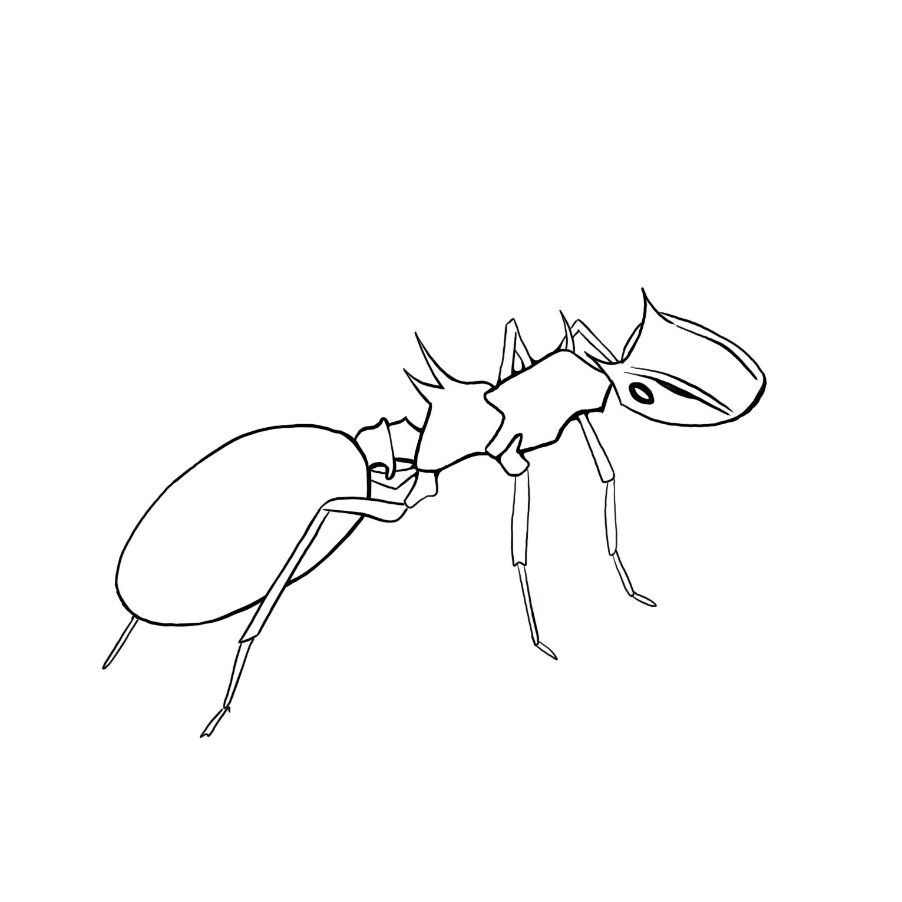

```{r setup, include=FALSE}

knitr::opts_chunk$set(echo = FALSE, warning = FALSE, message = FALSE)
library(vitae)
library(tidyverse)
library(pander)
library(googlesheets4)
library(glue)
library(yaml)
library(knitr)

# Define a custom function that will print nice bulleted lists for the publication and talks sections:
catListReverse <- function(x, out.format = knitr::opts_knit$get("out.format"),
                      environment = "itemize",
                      marker = NULL) {
  if (out.format == "markdown") {
    if (!missing(environment) || !missing(marker)) {
      warning("Ignoring arguments that are not supported for markdown output.")
    }
    out <- sprintf("\n\n%s\n \n", paste("*", x, collapse = "\n"))
  } else {
    if (out.format == "latex") {
      itemCommand <- if (missing(marker)) {
        "\\item"
      } else {
          sprintf("\\item[%s]", marker)
      }
      listEnv <- c(
        sprintf("\\begin{%s}\n", environment),
        sprintf("\n\\end{%s}\n", environment))
      out <- paste(itemCommand, x, collapse = "\n")
      out <- sprintf("%s%s%s", listEnv[1], out, listEnv[2])
    } else {
      stop("Output format not supported.")
    }
  }
    return(knitr::asis_output(out))
}

# Define a custom function that will print nice bulleted lists for the publication and talks sections:
catList <- function(x, out.format = knitr::opts_knit$get("out.format"),
                      environment = "itemize",
                      marker = NULL) {
  if (out.format == "markdown") {
    if (!missing(environment) || !missing(marker)) {
      warning("Ignoring arguments that are not supported for markdown output.")
    }
    out <- sprintf("\n\n%s\n \n", paste("*", x, collapse = "\n"))
  } else {
    if (out.format == "latex") {
      itemCommand <- if (missing(marker)) {
        "\\item"
      } else {
          sprintf("\\item[%s]", marker)
      }
      listEnv <- c(
        sprintf("\\begin{%s}\n", environment),
        sprintf("\n\\end{%s}\n", environment))
      out <- paste(itemCommand, x, collapse = "\n")
      out <- sprintf("%s%s%s", listEnv[1], out, listEnv[2])
    } else {
      stop("Output format not supported.")
    }
  }
    return(knitr::asis_output(out))
}

# Define a function to print nice numbered lists for talks and papers:
printNumberedListReverse <- function(x, 
                              out.format = knitr::opts_knit$get("out.format"),
                              environment = "itemize",
                              marker = NULL) {
  if (out.format == "markdown") {
    if (!missing(environment) || !missing(marker)) {
      warning("Ignoring arguments that are not supported for markdown output.")
    }
    listItem <- as.character(paste(rev(seq_along(x)),
                                   ". ",
                                   x,
                                   sep = ""))
    out <- sprintf("\n\n%s\n \n", 
                   paste(listItem,
                         "\n",
                         sep = ""),
                         collapse = "\n")
    out2 <- sprintf("\n\n%s\n \n", 
                   paste(paste(rev(seq_along(x)),
                               ". ",
                               x,
                               sep = ""),
                         collapse = "\n"))
  } else {
    print("latex")
   # if (out.format == "latex") {
     # itemCommand <- if (missing(marker)) {
      #  "\\item"
      #} else {
      #    sprintf("\\item[%s]", marker)
     # }
     # listEnv <- c(
      #  sprintf("\\begin{%s}\n", environment),
      #  sprintf("\n\\end{%s}\n", environment))
     #out <- paste(itemCommand, x, collapse = "\n")
     # out <- sprintf("%s%s%s", listEnv[1], out, listEnv[2])
   # } else {
   #   stop("Output format not supported.")
   # }
  }
    return(knitr::asis_output(out,
                              cacheable = FALSE))
}

# Define a function to print nice numbered lists for talks and papers:
printNumberedList <- function(x, 
                              out.format = knitr::opts_knit$get("out.format"),
                              environment = "itemize",
                              marker = NULL) {
  if (out.format == "markdown") {
    if (!missing(environment) || !missing(marker)) {
      warning("Ignoring arguments that are not supported for markdown output.")
    }
    listItem <- paste(seq_along(x),
                      ". ",
                      x,
                      sep = "")
    out <- sprintf("\n\n%s\n \n", 
                   paste(listItem,
                         "\n",
                         sep = ""),
                         collapse = "\n")
  } else {
    print("latex")
   # if (out.format == "latex") {
     # itemCommand <- if (missing(marker)) {
      #  "\\item"
      #} else {
      #    sprintf("\\item[%s]", marker)
     # }
     # listEnv <- c(
      #  sprintf("\\begin{%s}\n", environment),
      #  sprintf("\n\\end{%s}\n", environment))
     #out <- paste(itemCommand, x, collapse = "\n")
     # out <- sprintf("%s%s%s", listEnv[1], out, listEnv[2])
   # } else {
   #   stop("Output format not supported.")
   # }
  }
    return(knitr::asis_output(out,
                              cacheable = FALSE))
}

# Read in data:
CVData <- read_sheet("https://docs.google.com/spreadsheets/d/1EF4cO7h3tsKhbuJta43pKPsULGgUzWdK806L1hkwF-8/edit?usp=sharing")

# Process data into sub-tibbles:
Education <- dplyr::filter(CVData, Category == "Education")
Research <- dplyr::filter(CVData, Category == "Research Experience")
Curation <- dplyr::filter(CVData, Category == "Curation")
Teaching <- dplyr::filter(CVData, Category == "Teaching")
Awards <- dplyr::filter(CVData, Category == "Awards")
Mentoring <- dplyr::filter(CVData, Category == "Mentoring")
Service <- dplyr::filter(CVData, Category == "Service")
Reviewer <- dplyr::filter(CVData, Category == "Reviewer")
Societies <- dplyr::filter(CVData, Category == "society")
Outreach <- dplyr::filter(CVData, Category == "Outreach")
Publications <- dplyr::filter(CVData, Category == "Publications")
Talks <- dplyr::filter(CVData, Category == "Talks")

```

# Education 
```{r}
detailed_entries(Education, 
                 when = glue("{Start}--{End}"),
                 what = Supervisor,
                 where = Institution,
                 with = Position,
                 why = Details)
```

# Publications
\footnotesize 
Double dagger (‡) indicates co-first authors. 
Dagger (†) indicates mentored undergraduate co-author. 
\normalsize

**Published:**
\scriptsize
```{r results='asis', cache=FALSE}

published <- Publications %>%
  filter(Type == "Published") %>%
  pull("Details") 
printNumberedList(published)

```
\normalsize

**In revision:** 

\scriptsize 
Manucripts available upon request. 

```{r results='asis', cache=FALSE}
inReview <- Publications %>%
  filter(Type == "inRevision") %>%
  pull("Details") 
printNumberedList(inReview)
```
\normalsize 


**Submitted:**

\scriptsize
Manucripts available upon request. 

```{r results='asis', cache=FALSE}
inPrep <- Publications %>%
  filter(Type == "Submitted") %>%
  pull("Details") 
printNumberedList(inPrep)
```
\normalsize 

# Grants, Fellowships & Awards

**Research grants     (Total amount: $17,500)**
\scriptsize
```{r}
Awards %>%
filter(Type == "researchGrant") %>%
pull("Details") %>%
catList()

```
\normalsize

**Conference travel grants     (Total amount: $1,250)**
\scriptsize
```{r}
Awards %>%
filter(Type == "conferenceGrant") %>%
pull("Details") %>%
catList()

```
\normalsize

**Fellowships     (Total amount: $233,655)**
\scriptsize
```{r}
Awards %>%
filter(Type == "Fellowship") %>%
pull("Details") %>%
catList()

```
\normalsize

**Awards**
\scriptsize
```{r}
Awards %>%
filter(Type == "Award") %>%
pull("Details") %>%
catList()

```
\normalsize

# Talks
\footnotesize 
Dagger (†) indicates presenter. 

\normalsize
**Invited seminars:**
\scriptsize
```{r results='asis'}
invited <- Talks %>%
  filter(Type == "invited") %>%
  pull("Details") 
printNumberedList(invited)
```
\normalsize
**Oral presentations:**
\scriptsize
```{r results='asis'}
oral <- Talks %>%
  filter(Type == "Oral") %>%
  pull("Details") 
printNumberedList(oral)
```
\normalsize
<!-- **Lightning talks:**
\scriptsize
```{r results='asis'}
lightning <- Talks %>%
  filter(Type == "Lightning") %>%
  pull("Details") 
printNumberedList(lightning)
```
\normalsize -->
**Posters:**
\scriptsize
```{r results='asis'}
poster <- Talks %>%
  filter(Type == "Poster") %>%
  pull("Details") 
printNumberedList(poster)

```
\normalsize

# Research Positions
```{r}
detailed_entries(Research, 
                 when = glue("{Start}--{End}"),
                 what = Supervisor,
                 where = Institution,
                 with = Position,
                 why = Details)
```

# Curatorial Skills & Experiences 
```{r}
detailed_entries(Curation, 
                 when = glue("{Start}--{End}"),
                 what = Supervisor,
                 where = Institution,
                 with = Position,
                 why = Details)
```

# Teaching 
```{r}
detailed_entries(Teaching, 
                 when = glue("{Start}--{End}"),
                 what = Supervisor,
                 where = Institution,
                 with = Position,
                 why = Details)
```

# Mentoring Experiences

```{r}
detailed_entries(Mentoring, 
                 when = glue("{Start}--{End}"),
                 what = Supervisor,
                 where = Institution,
                 with = Position,
                 why = Details)

```


# Service 
```{r}
detailed_entries(Service, 
                 when = glue("{Start}--{End}"),
                 what = Supervisor,
                 where = Institution,
                 with = Position,
                 why = Details)
```

**Journal referee:**
\scriptsize
```{r}
Reviewer %>%
filter(Type == "reviewer") %>%
pull("Details") %>%
catList()

```
\normalsize

**Society membership:**
\scriptsize
```{r}
Societies %>%
filter(Type == "society") %>%
pull("Details") %>%
catList()

```
\normalsize

\textcolor{white}{test}

# Outreach 
```{r}
detailed_entries(Outreach, 
                 when = glue("{Start}--{End}"),
                 what = Supervisor,
                 where = Institution,
                 with = Position,
                 why = Details)
```


```{r  out.width = "15%", fig.align="center"}
 
```